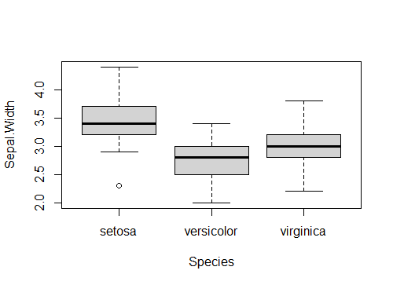

# Postwork Sesión 5
## OBJETIVO
- Realizar inferencia estadística para extraer información de la muestra que sea contrastable con la población
## REQUISITOS
- Haber desarrollado los postworks anteriores
- Cubrir los temas del prework
- Replicar los ejemplos de la sesión
## DESARROLLO
El data frame iris contiene información recolectada por Anderson sobre 50 flores de 3 especies distintas (setosa, versicolor y virginca), incluyendo medidas en centímetros del largo y ancho del sépalo así como de los pétalos.
Estudios recientes sobre las mismas especies muestran que:

### - En promedio, el largo del sépalo de la especie setosa (Sepal.Length) es igual a 5.7 cm

**Establecimiento de hipotesis**   
>H<sub>O</sub>: En promedio, el largo del sépalo de la especie setosa es igual a 5.7 cm  
>H<sub>A</sub>: En promedio, el largo del sépalo de la especie setosa es diferente a 5.7 cm

>H<sub>O</sub>: promedio == 5.7 cm  
>H<sub>A</sub>: promedio != 5.7 cm  

**Nivel de significancia**
> NC = 0.01

**Test de dos colas**

```R
t.test(iris[iris$Species == 'setosa', "Sepal.Length"],conf.level=0.99,
       alternative = 'two.sided', mu=5.7)
```
**Resultado**

```R
data:  iris[iris$Species == "setosa", "Sepal.Length"]
t = -13.922, df = 49, p-value < 2.2e-16
```

**Conclusión**
> p-value = 2.2e-16  < 0.01 (99% NC)  
> EEE para rechazar Ho a favor de Ha es decir el promedio es diferente a 5.7 cm"

### - En promedio, el ancho del pétalo de la especie virginica (Petal.Width) es menor a 2.1 cm

**Establecimiento de hipotesis** 
>H<sub>O</sub>: En promedio, el ancho del pétalo de la especie virginica es mayor o igual a 2.1 cm  
>H<sub>A</sub>: En promedio, el ancho del pétalo de la especie virginica es menor a 2.1 cm

>H<sub>O</sub>: promedio >= 2.1 cm  
>H<sub>A</sub>: promedio < 2.1 cm  

**Nivel de significancia**  
> NC = 0.01

**Test de cola inferior**

```R
t.test(iris[iris$Species=="virginica", "Petal.Width"],conf.level=0.99,
       alternative = "less", mu=2.1)
```
**Resultado**

```R
data:  iris[iris$Species == "virginica", "Petal.Width"]
t = -1.9052, df = 49, p-value = 0.03132
```

**Conclusión**
> p-value = 0.03132  > 0.01 (99% NC)  
> No EEE para rechazar (NO rechazo Ho) es decir el promedio del ancho es mayor o igual que 2.1

#### - En promedio, el largo del pétalo de la especie virgínica es 1.1 cm más grande que el promedio del largo del pétalo de la especie versicolor.
**Establecimiento de hipotesis**
>H<sub>O</sub>: En promedio, el ancho del pétalo de la especie virginica es mayor o igual a 2.1 cm    
>H<sub>A</sub>: En promedio, el ancho del pétalo de la especie virginica es menor a 2.1 cm  

>H<sub>O</sub>: promedio_largo_petalo_virginica-promedio_largo_petalo_versicolor <= 1.1 cm    
>H<sub>A</sub>: promedio_largo_petalo_virginica-promedio_largo_petalo_versicolor > 1.1 cm    

**Nivel de significancia**  
> NC = 0.01

**Test de cola superior**

```R
var.test(iris[iris$Species == "virginica", "Petal.Length"], 
         iris[iris$Species == "versicolor", "Petal.Length"], 
         ratio = 1, alternative = "two.sided",conf.level = 0.99)
         
t.test(iris[iris$Species == "virginica", "Petal.Length"],
       iris[iris$Species == "versicolor", "Petal.Length"],
       alternative = "greater",conf.level = 0.99, mu = 1.1, var.equal = TRUE,)
```
**Resultado**

```R
data:  iris[iris$Species == "virginica", "Petal.Length"] and iris[iris$Species == "versicolor", "Petal.Length"]
F = 1.3794, num df = 49, denom df = 49, p-value = 0.2637

data:  iris[iris$Species == "virginica", "Petal.Length"] and iris[iris$Species == "versicolor", "Petal.Length"]
t = 1.873, df = 98, p-value = 0.03202
```

**Conclusión**
> p-value = 0.03203  > 0.01 (99% NC)  
> p-value = 0.03203 > 0.01 (99% NC) No EEE para rechazar Ho  
> Es decir el promedio de largo del petalo virginica no es mas grande que el de la versicolor

### - En promedio, no existe diferencia en el ancho del sépalo entre las 3 especies.
**Establecimiento de hipotesis**
>H<sub>O</sub>: El promedio del ancho del sépalo de las tres especies es igual  
>H<sub>A</sub>: Existe al menos un par especies cuyos promedios de ancho de sépalo es distinto


**Nivel de significancia**  
> NC = 0.01


```R
tapply(iris$Sepal.Width, iris$Species, mean)

boxplot(Sepal.Width ~ Species, data = iris)

anova <- aov(Sepal.Width ~ Species,
             data = iris)
summary(anova)

TukeyHSD(anova)
plot(TukeyHSD(anova))
```
**Resultado**
```R
tapply(iris$Sepal.Width, iris$Species, mean)
    setosa versicolor  virginica 
     3.428      2.770      2.974 
     
summary(anova)
             Df Sum Sq Mean Sq F value Pr(>F)    
Species       2  11.35   5.672   49.16 <2e-16 ***
Residuals   147  16.96   0.115 
```




**Conclusión**
> p-value <2e-16   
> p-value < 0.01 (99% NC) EEE para rechazar Ho  
>Hemos obtenido un p-valor del orden de 2e-16. Esto nos permite rechazar la hipótesis nula en favor d ela hipotesis alternativa y concluir que el ancho se sépalo para las diferentes especies  de flor iris consideradas NO son iguales. La gráfica de diferencias de promedios y el diagrama boxplot apoyan visualmente el rechazo de la hipótesis nula

Utilizando pruebas de inferencia estadística, concluye si existe evidencia suficiente para concluir que los datos recolectados por Anderson están en línea con los nuevos estudios.

Utiliza 99% de confianza para toda las pruebas, en cada caso realiza el planteamiento de hipótesis adecuado y concluye.
