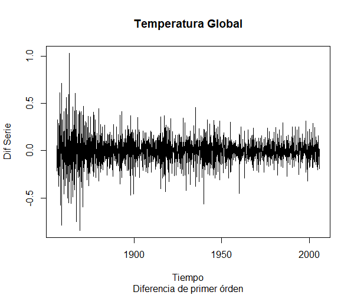
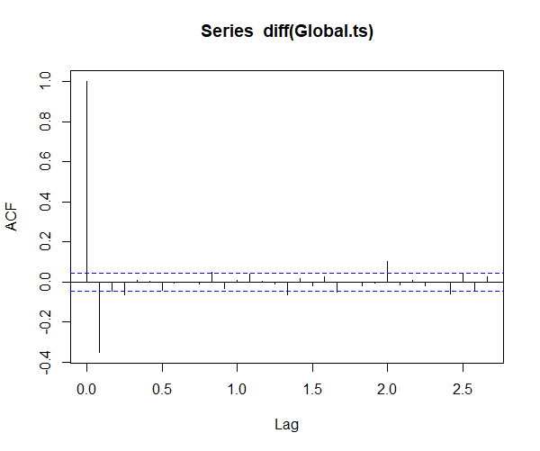
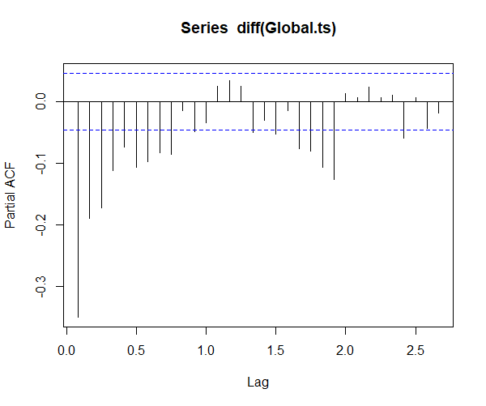

# Postwork Sesión 07. 
# Predicciones de la temperatura global
## OBJETIVO
- Estimar modelos ARIMA y realizar predicciones
## DESARROLLO
Utilizando el siguiente vector numérico, realiza lo que se indica:
```
url = "https://raw.githubusercontent.com/beduExpert/Programacion-R-Santander-2022/main/Sesion-07/Data/global.txt"
Global <- scan(url, sep="")
```
1. Crea una objeto de serie de tiempo con los datos de Global. La serie debe ser mensual comenzado en Enero de 1856
```R
Global.ts <- ts(Global, st = c(1856, 1), fr = 12)
```

2. Realiza una gráfica de la serie de tiempo anterior de 2005"
> La temperatura se mantuvo constante hasta 1950 a partir de alli ha aumentado en promedio 0.7 grados a 2006
```R
plot(Global.ts, xlab = "Tiempo", ylab = "Temperatura en grados Celsius", 
     main = "Temperatura Global",
     sub = "Serie mensual: Ene/1856 a Dic/2006")

```

3. Ahora realiza una gráfica de la serie de tiempo anterior, transformando a la primera diferencia:
> Transformando primera diferencia: diff(Global.ts)
```R
plot(diff(Global.ts), xlab = "", ylab = "")
title(main = "Temperatura Global",
      xlab = "Tiempo", ylab = "Dif Serie",
      sub = "Diferencia de primer órden")
```

4. ¿Consideras que la serie es estacionaria en niveles o en primera diferencia?
> Si es estacionaria a partir de la primera diferencia y a partir del año 1900 
5. Con base en tu respuesta anterior, obten las funciones de autocorrelación y autocorrelación parcial?
> Funcion de autocorrelación  
```R
acf(diff(Global.ts))
```

> Función de autocorrelación Parcial
```R
pacf(diff(Global.ts))
```

